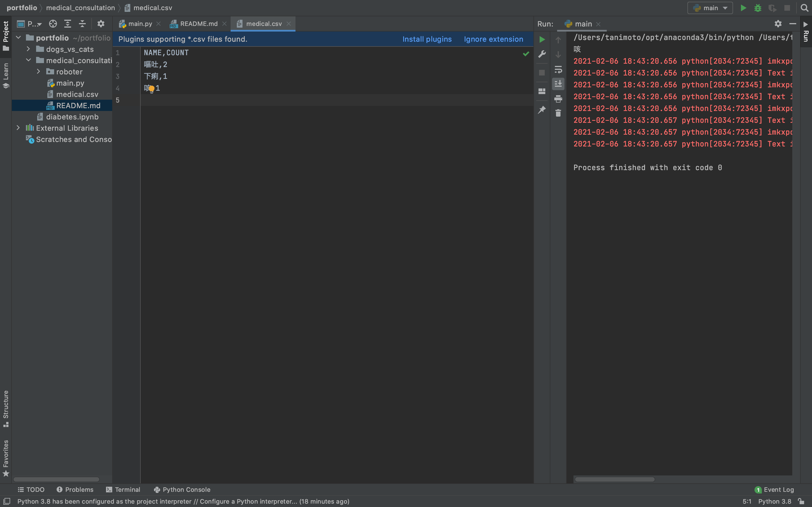

# Name  

tkinterライブラリを用いたチェックボックス問診アプリ  
チェックされた質問はcsvファイルに出力される

# Features

main.py  
tkinterライブラリを用いてチェックボックス  


conversation.py  
質問、回答、csvファイルの読み込み、書き込みを順番に呼び出す

robot.py  
to_csv.pyを呼び出す

to_csv.py  
csvファイルの読み込みと書き込みを行う  

 
# 実行環境

Pycharm

# Requirement
 
"main.py"を動かすのに必要なライブラリ  
tkinter  
sys  
os  
collections  
pathlib  
csv  

# Installation
 
Requirementで列挙したライブラリなどのインストール方法
 
```terminal  
pip install tkinter  
pip install sys  
pip install os  
pip install collections  
pip install pathlib  
pip install csv  

```
 
# Usage
 
"pubmed.py"の基本的な使い方
 
```bash
git clone 
python3 main.py
```
 
# Author
 
* tanimoto